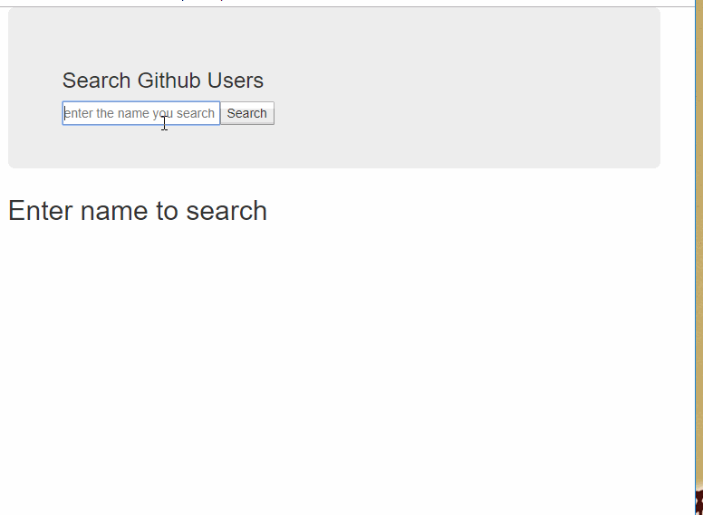

# 1. 尚硅谷学习进度

## 2021年01月23日

> react教程：01~02

## 2021年01月24日11

> react教程：03~06 （03: 52）

## 2021年01月25日

> react教程：06

## 2021年01月26日

> react教程：07~13

## 2021年01月27日

> react教程：14~20(02:28)

## 2021年01月28日

> react教程：20~23

## 2021年01月29日

> react教程：24~37(32.15)

## 2021年01月31日

> react教程：37~45(02.06)

## 2021年02月01日

> react教程：45~50

## 2021年02月02日

> react教程：51~60

## 2021年02月03日

> react教程：61~66(18.53)

## 2021年02月04日

> react教程：66~73(00:47)

## 2021年02月05日

> react教程：73~82

## 2021年02月06日

> react教程：83~85(06.56)

## 2021年02月07日

> react教程：85~91

## 2021年02月19日

> react后台管理项目(01~15)

```text
react后台管理项目：  
1. 组件按需打包   ✔
2. antd 按需引入配置  ✔
3. antd默认主题配置（修改默认样式） ✔
4. 路由配置 ✔
5. css reset（github搜索reset  minirest) ✔
```

## 2021年02月20日

> react教程：92~100

```text
1. withRouter 解决一般组件实现路由跳转 withRouter(Header)

// redux学习
1. 引入redux
2. 创建store
3. 创建reducer
4. 在组件中引入store
5. 组件调用store.dispatch分发通知redux
6. 检测redux状态变化，更新视图
7. 全局监听redux状态变化
```

## 2021年 02月22日

> react教程：101~107

```text
1. redux constant配置
2. redux actionCreate配置
3. 同步action和异步action
```

<hr style="height:2px;background:  deepskyblue;"/>

# 2. 案例简介

## 2.1 todoList案例  (✔)



```text
资源：
  1. 功能效果如上gif图
  2. 静态资源(F:\myPro\react_资料\react全家桶资料\04_静态页面\todos_page)
```

## 2.2 配置代理案例 （✔）

```text
1. axios配置
2. 启动node服务 (F:\myPro\react_资料\react全家桶资料\06_其他\测试代理服务器\server1 和 server2)
3. 配置setupProxy.js
```

## 2.2 github搜索案例 （?）


```text
  资源：
    1. 功能效果如上gif图
    2. 静态资源 (F:\myPro\react_资料\react全家桶资料\04_静态页面\users_page)
    3. 表单使用非受控或受控组件方式
    4. 发送axios请求  (get请求;参数:q=?;地址: localhost:5000/search/user2)
    5. 服务器地址（F:\myPro\react_资料\react全家桶资料\05_所需服务器\server）
    
  功能点：
    1. 搜索功能
    2. 列表渲染功能
    3. 列表展示4种状态(**)
      + 列表信息
      + 首次显示内容
      + loading状态
      + error网络异常状态显示
  高端操作：
     1. 发布订阅实现兄弟组件传值 (pubsub-js)
     2. fetch发送请求
```

## 2.3 antd按需引入(antd 4.x)

```text
// 第一步

npm install react-app-rewired customize-cra babel-plugin-import -D

// 或者
yarn add customize-cra react-app-rewired --dev

//第二步 修改package.json文件

"scripts": {
    "start": "react-app-rewired start",  //主要修改就是把以前的react-scripts包替换为react-app-rewired
    "build": "react-app-rewired build",
    "test": "react-app-rewired test",
    "eject": "react-app-rewired eject"
  },
//第三步
在项目根目录下创建config-overrides.js文件

const { override, fixBabelImports } = require("customize-cra");
module.exports = override(
    fixBabelImports('import', {
        libraryName: 'antd',
        libraryDirectory: 'es',
        style: true,//或者css, true代表运用less
    }),
);
```

## 2.4 react-redux的使用规则（类似vuex使用）


